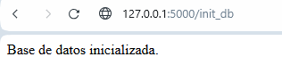
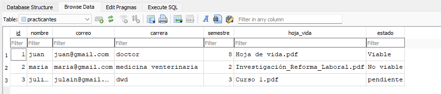

# Plataforma de Registro y Evaluación de Practicantes

Este proyecto es una aplicación web que permite registrar practicantes y que un analista pueda evaluar su información marcándolos como viables o no viables. Incluye autenticación básica y descarga de hoja de vida en PDF.

---

## 🚀 Tecnologías Usadas

- Python 3
- Flask
- SQLite3
- HTML5 + CSS3
- JavaScript
- Bootstrap (opcional)
- Visual Studio Code

---

## 📦 Instalación y Ejecución
Instrucciones Iniciales (Paso a paso)
Crea una carpeta de trabajo en tu equipo con el nombre que prefieras. Esta será la ubicación donde guardarás el proyecto.

Instala Visual Studio Code si aún no lo tienes:
Puedes descargarlo desde el sitio oficial:
👉 https://code.visualstudio.com/download

Abre Visual Studio Code.
Una vez abierto, selecciona "Archivo > Abrir carpeta" y elige la carpeta que creaste en el paso 1.

Abre la terminal integrada en Visual Studio Code:

Ve a "Terminal > Nueva Terminal", o presiona Ctrl + ñ.

Ejecuta los siguientes comandos uno por uno:

# 1. Crear un entorno virtual
python -m venv venv

# 2. Activar el entorno virtual
# En Windows:
venv\Scripts\activate

# En Linux o Mac:
source venv/bin/activate

# 3. Instalar Flask
pip install flask
⚠️ Asegúrate de que la terminal esté dentro del directorio del proyecto al ejecutar los comandos.

🚀 Ejecutar la Aplicación y Acceder al Sistema
Una vez tengas todos los archivos del proyecto en la carpeta correcta y hayas instalado las dependencias necesarias (incluyendo Flask), puedes iniciar la aplicación con los siguientes pasos:

✅ 1. Ejecutar la aplicación Flask
En la misma terminal donde activaste tu entorno virtual, ejecuta:

python app.py

Si todo está correcto, deberías ver un mensaje similar a este en la terminal:

* Running on http://127.0.0.1:5000

✅ 2. Abrir el formulario de practicantes
Una vez que el servidor esté en ejecución, abre tu navegador web y visita:

http://127.0.0.1:5000

Ahí verás el formulario de registro para practicantes, donde podrán ingresar su información y cargar su hoja de vida.

✅ 3. Inicializar la base de datos (solo la primera vez)
Antes de registrar practicantes, asegúrate de crear la tabla en la base de datos:

Abre esta URL en tu navegador:

http://127.0.0.1:5000/init_db

Verás el mensaje:

Base de datos inicializada. 

✅ 4. Acceder al panel del analista
Para acceder al panel privado de los analistas:

Abre esta URL en tu navegador:
http://127.0.0.1:5000/login

Ingresa las credenciales:

Usuario:     analista  
Contraseña:  1234

Serás redirigido al panel de analista, donde podrás:

Ver la lista de practicantes registrados.

Descargar hojas de vida en PDF.

Marcar a cada practicante como Viable o No viable.

Cerrar sesión de forma segura.

💡 Tip Final:
Si deseas ver los registros directamente en la base de datos, puedes abrir el archivo database.db con una herramienta como DB Browser for SQLite, ir a la pestaña "Browse Data" y seleccionar la tabla practicantes.

Como se muestra en esta imagen 

